# 🥖 Panificadora & Empório Dona Clara

## 📌 Sobre o projeto

O **Panificadora & Empório Dona Clara** é um projeto acadêmico de desenvolvimento web desenvolvido para representar a presença digital de uma panificadora e empório fictício.

O projeto apresenta uma interface responsiva e organizada, permitindo ao usuário conhecer o estabelecimento, consultar o cardápio, visualizar produtos, realizar uma solicitação de encomenda e acessar informações de contato.

A proposta foi desenvolvida considerando princípios de **organização visual, usabilidade, responsividade e identidade visual**, buscando criar uma experiência simples, intuitiva e acolhedora para o usuário.

---

## 🎯 Objetivo

Desenvolver um site responsivo, organizado e intuitivo para a **Panificadora & Empório Dona Clara**, proporcionando ao usuário uma experiência digital para:

- Conhecer o estabelecimento;
- Consultar o cardápio;
- Visualizar produtos disponíveis;
- Conhecer diferentes categorias de produtos;
- Realizar uma solicitação de encomenda;
- Consultar informações de contato e localização.

---

## 💻 Tecnologias utilizadas

- **HTML5** — estrutura das páginas;
- **CSS3** — estilização e personalização da interface;
- **Bootstrap 5** — recursos de responsividade e componentes;
- **Git** — controle de versão;
- **GitHub** — hospedagem e versionamento do projeto.

---

## 📄 Páginas do projeto

### 🏠 Início

A página inicial apresenta a proposta da Panificadora & Empório Dona Clara, seus principais produtos e direciona o usuário para as demais áreas do site.

### 🥐 Cardápio

Apresenta os produtos disponíveis organizados em diferentes categorias, facilitando a visualização do cardápio.

As categorias incluem:

- Pães;
- Doces;
- Salgados.

### 📝 Encomendas

Apresenta um formulário para solicitação de encomendas, permitindo o preenchimento de informações como:

- Nome;
- Produto;
- Quantidade;
- Data;
- Observações.

### 📍 Contato

Disponibiliza informações de contato e localização, além de um formulário para comunicação com o estabelecimento.

---

## 🎨 Identidade visual

A identidade visual foi desenvolvida com uma proposta **acolhedora, artesanal e profissional**, buscando transmitir características relacionadas ao segmento de panificação.

### 🎨 Paleta de cores

- Creme;
- Marrom;
- Terracota;
- Verde oliva.

### ✒️ Tipografia

- **Playfair Display** — utilizada em títulos e destaques;
- **Poppins** — utilizada em textos, botões, menus e informações.

A combinação das cores e tipografias busca proporcionar uma identidade visual harmoniosa, acolhedora e relacionada à proposta da panificadora.

---

## 📱 Responsividade

O projeto foi desenvolvido para apresentar uma experiência adequada em diferentes tamanhos de tela.

Foram utilizados recursos do **Bootstrap 5** juntamente com estilos desenvolvidos em **CSS**, permitindo a adaptação da interface para diferentes dispositivos.

---

## 🖼️ Imagens utilizadas no projeto

As imagens utilizadas no site representam produtos relacionados à proposta da panificadora, incluindo pães, doces e salgados.

### 🍞 Pães

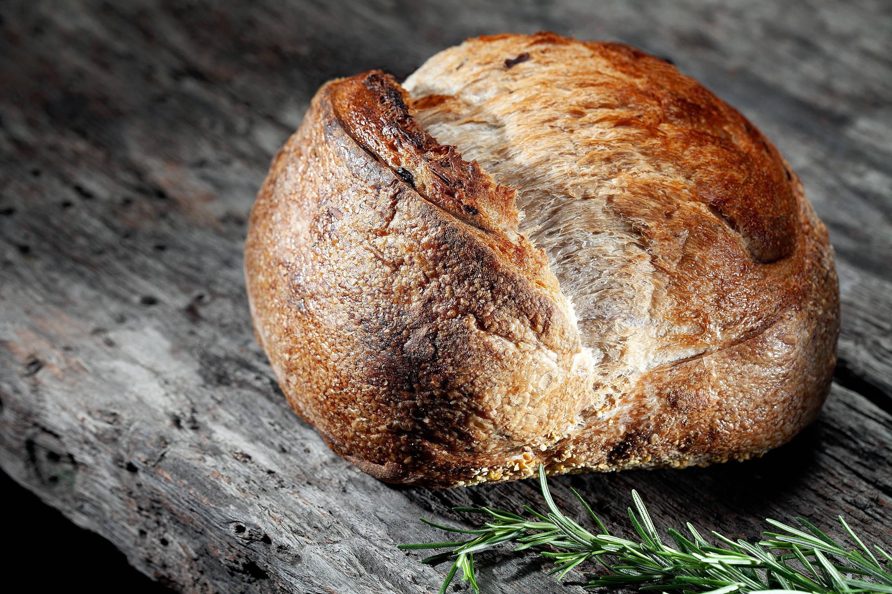

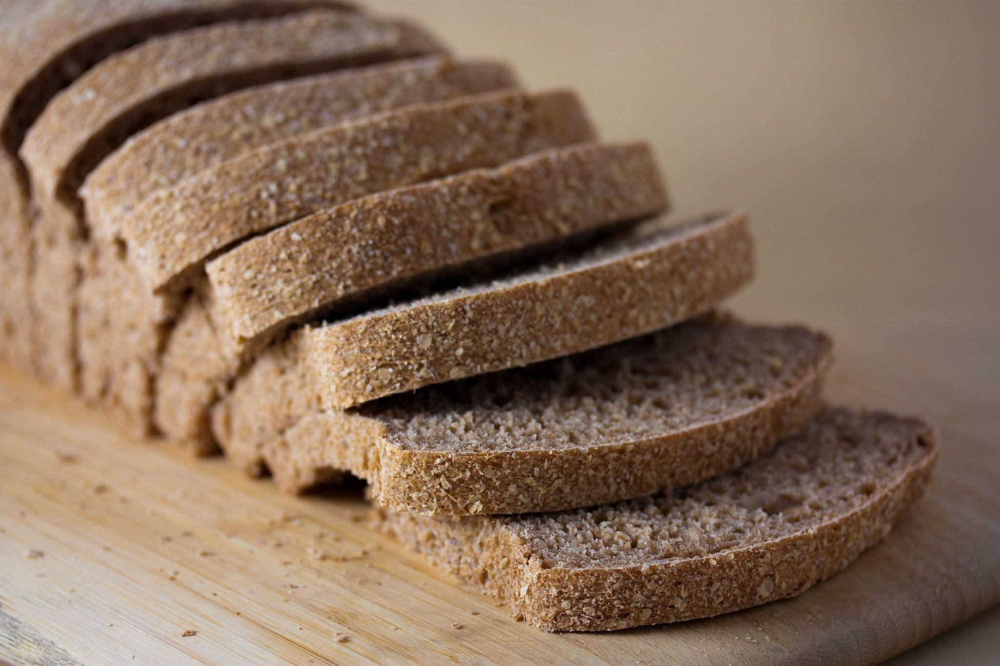

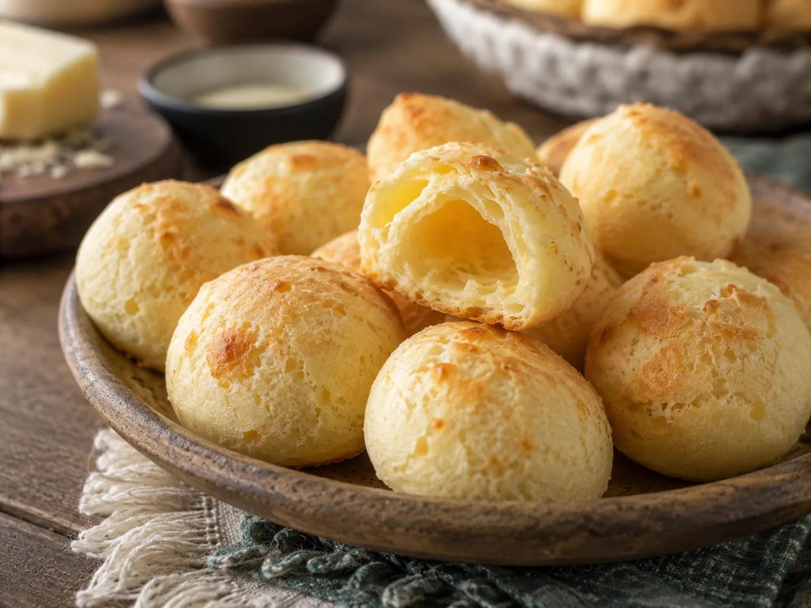

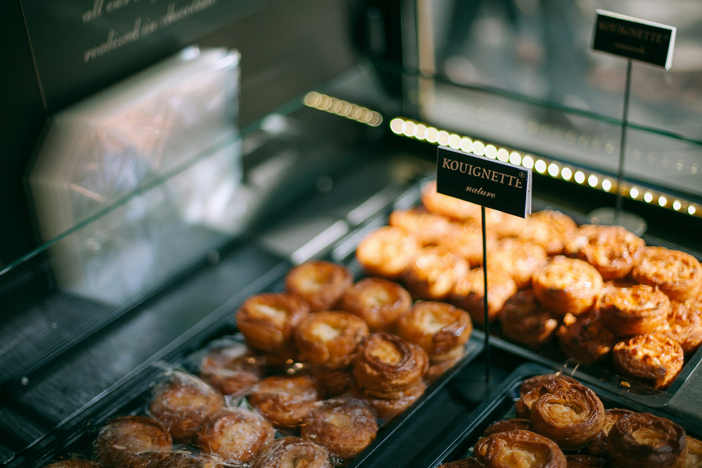

### 🍰 Doces

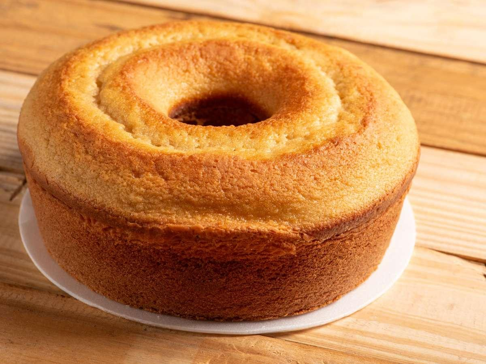

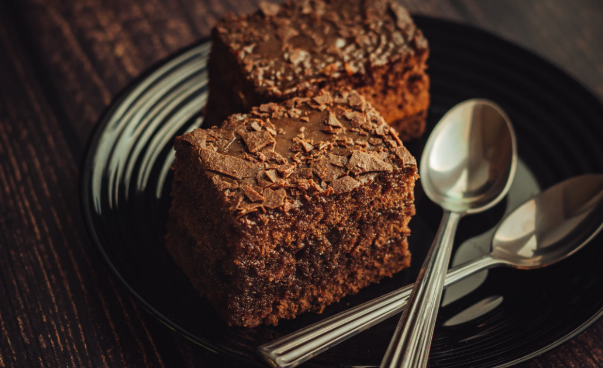

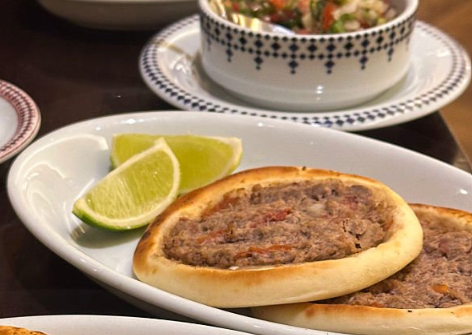

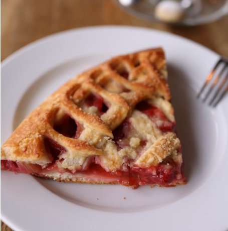


### 🥟 Salgados

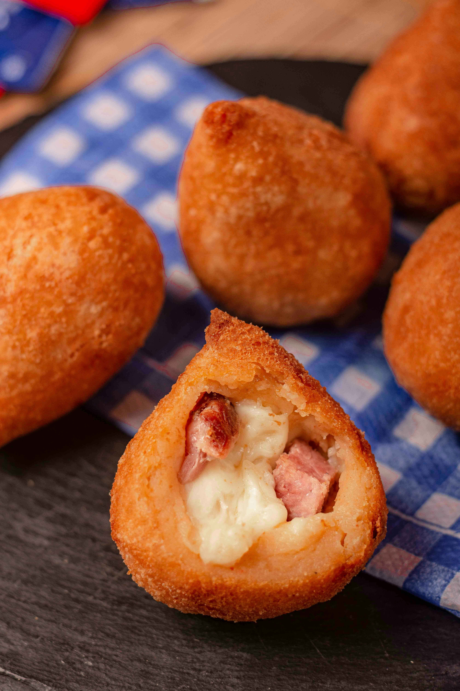

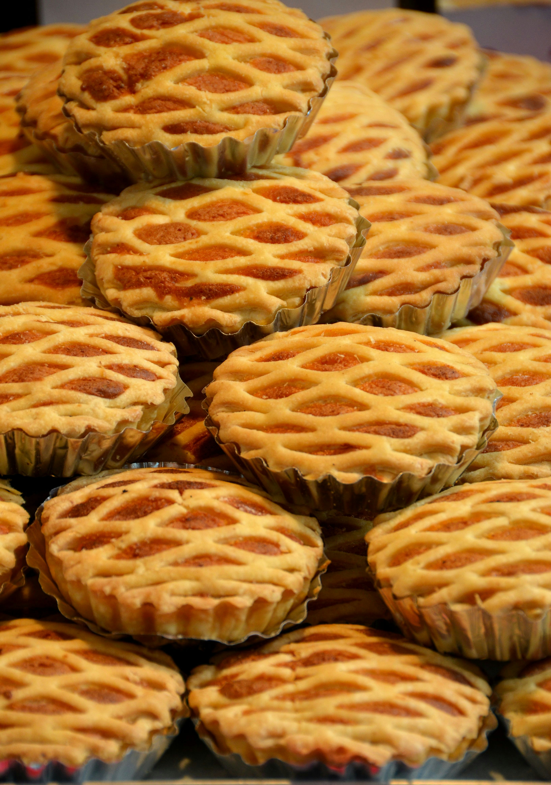

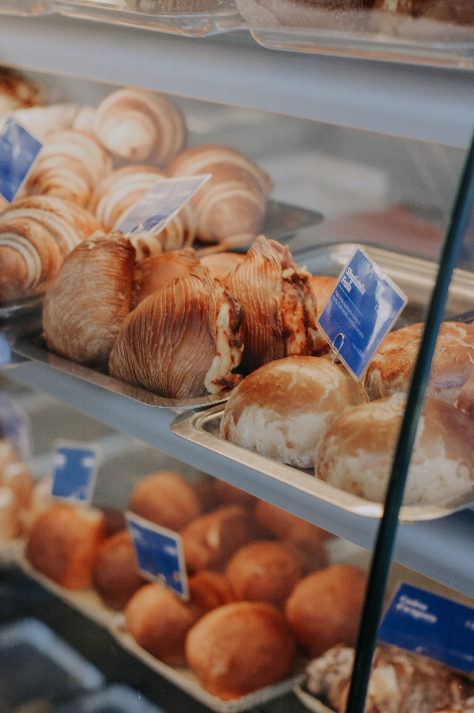

---

## 🧭 Fluxo de navegação

A proposta de navegação definida durante o planejamento do projeto segue o fluxo:

**Início → Cardápio → Carrinho → Encomenda → Confirmação**

Esse fluxo foi utilizado como referência para organizar a experiência do usuário e estruturar a proposta do projeto.

---

## 📁 Estrutura do projeto

```text
panificadora-dona-clara/
│
├── index.html
├── cardapio.html
├── encomendas.html
├── contato.html
│
├── css/
│   └── style.css
│
├── img/
│   ├── bolo-caseiro.jpg
│   ├── brownie.jpg
│   ├── coxinha.jpg
│   ├── doces.jpg
│   ├── empada.jpg
│   ├── esfiha.jpg
│   ├── paes.jpg
│   ├── pao.jpg
│   ├── pao-artesanal.jpg
│   ├── pao-integral.jpg
│   ├── pao-queijo.jpg
│   ├── salgados.jpg
│   └── torta.jpg
│
├── docs/
│   └── documentacao-projeto.pdf
│
└── README.md
```

---

## 📚 Documentação do projeto

A documentação reúne as etapas de planejamento e desenvolvimento do projeto **Panificadora & Empório Dona Clara**.

O documento apresenta:

- Problema identificado;
- Proposta de solução;
- Material desenvolvido no Canva;
- Protótipo de baixa/média fidelidade;
- Fluxo de navegação;
- Telas propostas;
- Identidade visual;
- Relação entre planejamento e desenvolvimento;
- Considerações finais.

📄 **[Acessar a documentação completa em PDF](docs/documentacao-projeto.pdf)**

> O material desenvolvido no Canva e o protótipo fazem parte da documentação em PDF e não estão armazenados como arquivos de imagem separados no repositório.

---

## ▶️ Como executar

Por se tratar de um projeto desenvolvido com **HTML, CSS e Bootstrap**, não é necessária uma instalação específica.

Para visualizar o projeto:

1. Faça o download ou clone o repositório;
2. Abra a pasta do projeto;
3. Abra o arquivo `index.html` em um navegador;
4. Utilize o menu de navegação para acessar as demais páginas.

---

## 🎓 Contexto acadêmico

Projeto desenvolvido como atividade acadêmica na área de **Desenvolvimento Web**, aplicando conhecimentos de:

- HTML5;
- CSS3;
- Bootstrap;
- Organização de páginas;
- Responsividade;
- Usabilidade;
- Identidade visual;
- Versionamento de código;
- Git e GitHub.

---

## 👩‍💻 Projeto

**Panificadora & Empório Dona Clara**

Projeto acadêmico desenvolvido para aplicação prática de conhecimentos de desenvolvimento web, planejamento de interface e organização de projetos utilizando Git e GitHub.

## 👩‍💻 Autoria

**Fernanda Mara**

Projeto acadêmico — Panificadora & Empório Dona Clara.
